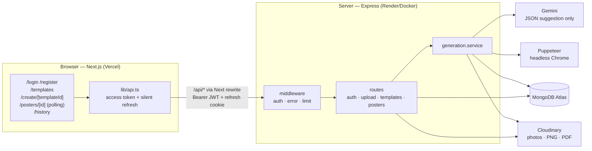
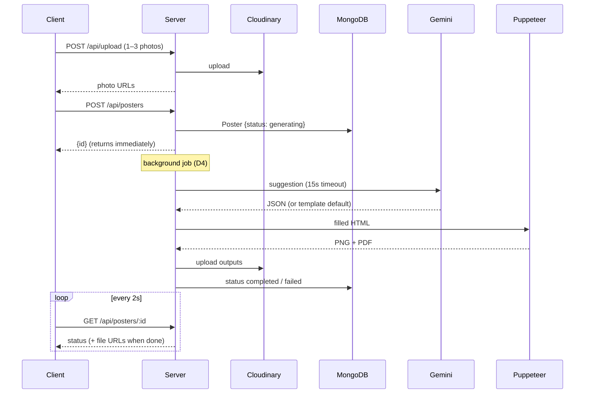

# System Architecture

One-page overview. Module details live in each module folder; the "why" lives in [decisions.md](decisions.md).

## Big picture

Hand-drawn board (system + poster flow): [system-design.excalidraw](diagrams/system-design.excalidraw) — open with the Obsidian Excalidraw plugin or excalidraw.com. Auth flow board: see [auth/architecture.md](auth/architecture.md).



- The browser calls `/api/*` on the client origin; Next.js rewrites proxy it to `server/` (D7).
- `client/` never talks to MongoDB, Cloudinary or Gemini directly — only to `server/` over REST.
- Gemini returns a **JSON suggestion** (colors, photo order, headline size). It never draws the poster or rewrites user text (D1).
- Puppeteer renders an HTML template with the user's exact Bangla text → PNG (2400×3200) + PDF.

`GET /api/health` → `{ status, db }` for uptime checks (Render) and local setup verification.

## Poster request flow



1. Client uploads 1–3 photos → `POST /api/upload` → Cloudinary URLs.
2. Client submits form → `POST /api/posters` → Poster saved with `status: generating` → response returns immediately.
3. Server, in background (D4): Gemini suggestion (15s timeout, fallback to template default) → fill HTML → Puppeteer → upload PNG/PDF → `status: completed` (or `failed`).
4. Client polls `GET /api/posters/:id` every 2s → shows preview → regenerate (max 3) or download.

## Modules

| Module | Owns | Code |
|---|---|---|
| [auth](auth/) | register, login, refresh, logout, roles | `routes/auth.ts`, `middleware/auth.ts`, `models/User.ts` |
| [storage](storage/) | photo + output upload | `routes/upload.ts`, `services/storage.service.ts` |
| [templates](templates/) | template library, seed | `routes/templates.ts`, `models/Template.ts`, `templates/*.html`, `scripts/seed.ts` |
| [posters](posters/) | request, status, history, regenerate, delete | `routes/posters.ts`, `models/Poster.ts` |
| [generation](generation/) | Gemini + Puppeteer pipeline | `services/{generation,gemini,render}.service.ts`, `models/GenerationLog.ts` |

## Folder layout

```
server/src/
  index.ts        app bootstrap (middleware, routes, DB connect)
  config/env.ts   env vars, validated with zod
  models/         Mongoose models
  routes/         one file per module: routes + handlers
  middleware/     auth, error, rate limit
  services/       external/shared logic (Gemini, Puppeteer, Cloudinary)
  templates/      poster HTML + bundled Bangla fonts
  scripts/        seed
client/src/
  app/            pages (folder = URL)
  components/     reusable UI
  lib/api.ts      single fetch helper (adds access token, silent refresh on 401, then /login)
```

## Deployment

| Part | Host | Notes |
|---|---|---|
| client | Vercel | `API_URL` → server URL; `/api/*` is proxied via rewrites (D7) |
| server | Render (Docker) | Chromium + fonts in image (D3) |
| database | MongoDB Atlas (M0) | |
| files | Cloudinary | |
