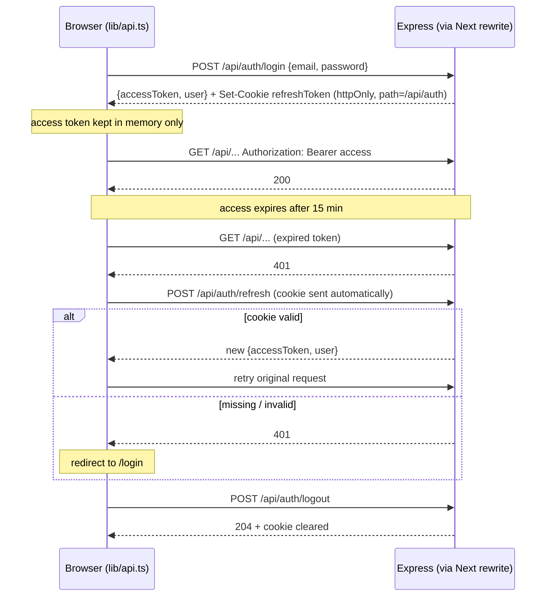

# Auth — Architecture

Access token + refresh cookie (D7).

| token | lifetime | where | signed with |
|---|---|---|---|
| access | 15 min | JSON body → client memory → `Authorization: Bearer` | `JWT_SECRET` |
| refresh | 7 days | `refreshToken` cookie: httpOnly, secure, sameSite=strict, path=`/api/auth` | `JWT_REFRESH_SECRET` |

Payload of both: `{ sub: userId, role }`. Refresh is not rotated or stored in the DB (MVP); logout only clears the cookie.

## Flow

Hand-drawn version: [auth-flow.excalidraw.md](../diagrams/auth-flow.excalidraw.md) (Obsidian Excalidraw plugin).

## Model `User`
| field | type | notes |
|---|---|---|
| name | string | required, ≤100 |
| email | string | required, unique, lowercase |
| passwordHash | string | bcrypt (10 rounds), `select: false`, never returned |
| role | `'user' \| 'admin'` | default `user` |
| createdAt, updatedAt | Date | timestamps |

Responses use `publicUser()` → `{ id, name, email, role }`.

## Endpoints
| method | path | auth | body → response |
|---|---|---|---|
| POST | `/api/auth/register` | – | `{name,email,password}` → 201 `{accessToken,user}` + cookie; 409 duplicate email |
| POST | `/api/auth/login` | – | `{email,password}` → `{accessToken,user}` + cookie; 401 `Invalid email or password` |
| POST | `/api/auth/refresh` | cookie | → `{accessToken,user}`; 401 if cookie missing/invalid or user deleted |
| POST | `/api/auth/logout` | – | → 204, clears cookie |
| GET | `/api/auth/me` | access | → `user` |

Password: 8–72 chars (bcrypt ignores bytes after 72).

## Middleware
- `requireAuth`: verifies Bearer access token, sets `req.user = { id, role }`, else 401.
- `requireAdmin`: after `requireAuth`, 403 if role ≠ admin.

## Client
- `next.config.ts` rewrites `/api/*` → `${API_URL}/api/*`, so the browser sees one origin (cookie is same-site, no CORS).
- `src/lib/api.ts`: `api(path, init)` adds the access token; on 401 (non-auth routes) it calls `/api/auth/refresh` once (shared across parallel requests), retries, and redirects to `/login` if refresh fails. Also `login`, `register`, `logout`, `getUser` (restores the session after reload).
- Pages: `src/app/(auth)/login`, `register` (shared `auth-form.tsx`); `src/app/user-menu.tsx` on the home page.

## Files
`server/src/models/User.ts`, `server/src/routes/auth.ts`, `server/src/middleware/auth.ts`

## Env
Server: `JWT_SECRET`, `JWT_REFRESH_SECRET` (32+ chars each, different). Client: `API_URL` (default `http://localhost:5000`).
